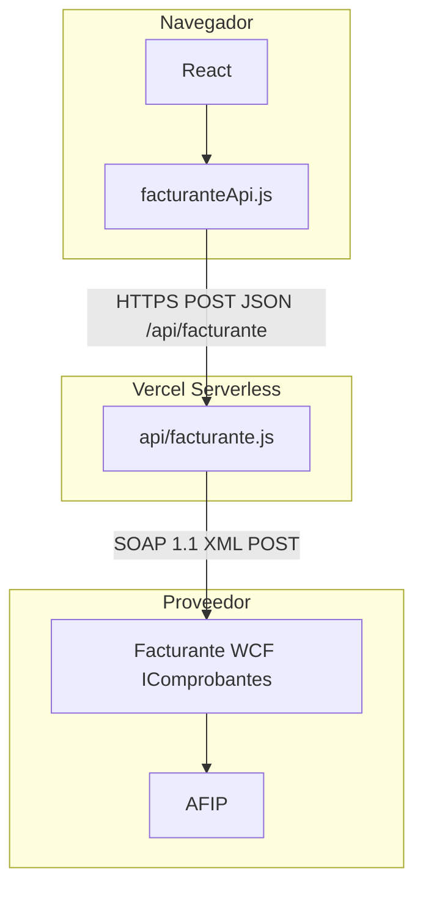

# Mapeo documentativo — API Facturante (homologación)

**Producto:** bigg-finance  
**Fecha del documento:** 2026-04-21  
**Fuente técnica canónica:** `[api/facturante.js](../api/facturante.js)`, `[src/lib/facturanteApi.js](../src/lib/facturanteApi.js)`

Este documento describe cómo la aplicación **usa** el servicio **Facturante** (WCF/SOAP) para emitir y consultar comprobantes electrónicos ante **AFIP** (Argentina). Está preparado para **homologación** o auditoría: capa intermedia (BFF), operaciones consumidas, mapeo de datos y controles de seguridad.

> **Entorno:** testing vs producción se define únicamente por la variable `FACTURANTE_ENDPOINT` y credenciales asociadas (no se incrusta en el código de aplicación el ambiente lógico).

---

## 1. Alcance funcional

| Incluido (implementado)                                                                                                        | Excluido o no implementado                                                                |
| ------------------------------------------------------------------------------------------------------------------------------ | ----------------------------------------------------------------------------------------- |
| Emisión: Factura y Nota de Crédito (vía `emitir`) con tipos con IVA (FA, FB, NCA, NCB) o sin IVA (F, NC, ND según `comp.type`) | **Anulación** de comprobantes: `action: "anular"` responde **HTTP 501** (sin implementar) |
| Consulta de detalle: número/prefijo AFIP y URL de PDF vía `DetalleComprobanteFull`                                             | Cualquier operación fuera de las listadas en la matriz §3                                 |
| Descarga de PDF: proxy HTTP en el BFF hacia la URL provista por Facturante                                                     | El navegador **no** se conecta directo al endpoint SOAP de Facturante                     |

**Disparo en UI (regla de producto):** emisión automática vía Facturante cuando, entre otros, la franquicia es Argentina, moneda **ARS**, documento **FACTURA** o **NC** y el emisor operativo acordado (p. ej. **ÑAKO SRL**), según `TabFacturador`, `AddCompModal`, flujos masivos en el mismo tab.

---

## 2. Arquitectura y trazas

- **Llamada SOAP:** `POST` al `FACTURANTE_ENDPOINT`, cuerpo XML, cabecera `SOAPAction: "http://www.facturante.com.API/IComprobantes/<Operacion>"`, timeout de solicitud **15 s** (código en `soapCall`).  
- **Límite de función:** `maxDuration: 30` s en Vercel para `[api/facturante.js](../vercel.json)`.  
- **Desarrollo local:** el dev server (Vite) enruta `/api/facturante` al handler; ver `[vite.config.js](../vite.config.js)`.

---

## 3. Matriz: acción JSON (BFF) → operación SOAP

El front solo habla con `**POST /api/facturante`** (JSON), excepto que `**getPdf`** con éxito devuelve cuerpo **binario** `application/pdf` (no JSON).

| `action`    | Cuerpo mínimo                                                                     | Operación SOAP (`IComprobantes`)                                                                       | Respuesta al cliente                                                                                                                                           |
| ----------- | --------------------------------------------------------------------------------- | ------------------------------------------------------------------------------------------------------ | -------------------------------------------------------------------------------------------------------------------------------------------------------------- |
| `emitir`    | `franchisor`, `franchise`, `comp`; para NC: `referenciaInvoice`, `referenciaDate` | `CrearComprobante` **o** `CrearComprobanteFull` (NC con asociado) **o** `CrearComprobanteSinImpuestos` | JSON: `ok`, `idComprobante`, `afipNumero`, `afipPrefijo`, `tipoComprobante`, `puntoVenta`, `mensaje` (p. ej. `afipNumero` nulo si el polling no obtuvo aún nº) |
| `getPdf`    | `idComprobante`                                                                   | `DetalleComprobanteFull` → se lee `URLPDF`; luego `GET` HTTPS al PDF                                   | Cuerpo PDF o JSON de error                                                                                                                                     |
| `getNumero` | `idComprobante`                                                                   | `DetalleComprobanteFull`                                                                               | JSON: `ok`, `numero`, `prefijo` o error                                                                                                                        |
| `anular`    | (cualquiera)                                                                      | —                                                                                                      | **501** JSON `error: Anulación no implementada aún`                                                                                                            |

**Selección de operación al emitir** (resumen; ver implementación en `api/facturante.js` a partir de `usaIVA` y `comp.type`):

- `franchise.applyIVA === true`: tipos string **FA / FB / NCA / NCB** según `FACTURA|NC` y categoría **RI** vs exento.  
  - **FACTURA** → `CrearComprobante` + `ComprobanteItem`.  
  - **NC** → `CrearComprobanteFull` + `ComprobanteItemFull` + `Asociados` (comprobante asociado).
- `applyIVA === false`: `CrearComprobanteSinImpuestos` con `F` / `NC` / `ND`.

**Namespaces (referencia WSDL, en código):**

- Operaciones: `http://www.facturante.com.API`  
- Data contracts: `http://schemas.datacontract.org/2004/07/FacturanteMVC.API` y `.../FacturanteMVC.API.DTOs`

---

## 4. Mapeo de negocio → XML (request SOAP `emitir`)

### 4.1 Autenticación

En todos los cuerpos de `emitir` y en `getDetalleComprobante` (PDF/número):

| Campo                   | Origen                        |
| ----------------------- | ----------------------------- |
| `Autenticacion.Empresa` | `FACTURANTE_EMPRESA` (entero) |
| `Autenticacion.Hash`    | `FACTURANTE_HASH`             |
| `Autenticacion.Usuario` | `FACTURANTE_USUARIO`          |

### 4.2 Cliente (receptor)

Origen: objeto `franchise` (y CUIT limpio sin guiones). Con IVA: se envían `TratamientoImpositivo` (1 RI, 4 Exento, 5 Cons. final, 6 Monotributo), `TipoDocumento` **6** (CUIT), `CondicionPago` (1 contado, 30 según lógica contado/NC). Sin IVA: `Cliente` sin IVA/Tratamiento extendido (variante `buildClienteSinIVAXml`).

| XML (conceptual)                                                                                | Origen en app                                                          |
| ----------------------------------------------------------------------------------------------- | ---------------------------------------------------------------------- |
| RazonSocial, NroDocumento, DireccionFiscal, Localidad, Provincia, CodigoPostal, MailFacturacion | `franchise` (razonSocial, cuit, domicilio/billing, emailFactura, etc.) |
| CondicionPago                                                                                   | 1 (contado) o 30 (cuenta corriente) según `comp.contado` y si es NC    |

### 4.3 Encabezado

Origen: `franchisor` (p. ej. `puntoVenta` como prefijo), `comp` (fecha, ref, monto, mes/año, `contado`).

| Campo (conceptual)              | Origen / regla en código                                                                     |
| ------------------------------- | -------------------------------------------------------------------------------------------- |
| TipoComprobante                 | Códigos FA, FB, NCA, NCB o F, NC, ND según tablas y documento                                |
| Prefijo                         | `franchisor.puntoVenta` (string)                                                             |
| FechaHora, FechaServDesde/Hasta | Mes del comprobante (`calcPeriodoServicio`); vencimientos                                    |
| Moneda, TipoDeCambio            | Moneda fija 2, TC 1                                                                          |
| Bienes                          | 2 (servicios)                                                                                |
| EnviarComprobante               | true                                                                                         |
| FechaVtoPago                    | Contado: alineada a emisión; cuenta corriente: día 10 del mes siguiente (`calcFechaVtoPago`) |
| Observaciones                   | `comp.ref`                                                                                   |
| Asociados (solo NC IVA)         | Desde `referenciaInvoice` parseado (prefijo y número) + `referenciaDate` / fecha del comp    |

### 4.4 Ítems

- **Con IVA (CrearComprobante):** un ítem; neto = `comp.amountNeto` (o `amount`); IVA 21 %; `Total` neto×1,21.  
- **Con IVA (CrearComprobanteFull, NC):** `ComprobanteItemFull` sin `Total` en el ítem (según builder).  
- **Sin IVA:** `ComprobanteItemSinImpuestos`, precio = `comp.amount`.

### 4.5 Post-emisión: polling del número AFIP

Tras respuesta exitosa con `idComprobante` > 0, el BFF invoca en bucle `DetalleComprobanteFull` (**hasta 5 intentos**, **2 s** de espera entre el segundo y los siguientes): `pollAfipNumero(id, 5, 2000)`. Si en ese lapso no hay `numero`, la respuesta JSON puede llevar `afipNumero: null`; el cliente puede usar `**getNumero`** más tarde. La implementación `pollAfipNumero` por defecto admite 8×2500 ms pero **el flujo de emisión usa 5×2000 ms**.

---

## 5. Matriz de tipos de comprobante (códigos Facturante usados en código)

| Documento + supuesto IVA / receptor                   | `TipoComprobante` (string) | Operación                                                 |
| ----------------------------------------------------- | -------------------------- | --------------------------------------------------------- |
| FACTURA, RI, con IVA                                  | FA                         | `CrearComprobante`                                        |
| FACTURA, no RI (exención lógica del builder), con IVA | FB                         | `CrearComprobante`                                        |
| NC, RI, con IVA                                       | NCA                        | `CrearComprobanteFull`                                    |
| NC, no RI, con IVA                                    | NCB                        | `CrearComprobanteFull`                                    |
| FACTURA sin IVA en app                                | F                          | `CrearComprobanteSinImpuestos`                            |
| NC sin IVA                                            | NC                         | `CrearComprobanteSinImpuestos`                            |
| ND (sin IVA)                                          | ND                         | `CrearComprobanteSinImpuestos` (si aplica en `comp.type`) |

*Compatibilidad de etiqueta legada en* `formatInvoiceLabel` *en* `facturanteApi.js`*: códigos numéricos 1, 3, 6, 8 mapeados a FA, FB, NCA, NCB.*

---

## 6. Seguridad

| Aspecto                 | Implementación                                                                                                                                                                                                                                                             |
| ----------------------- | -------------------------------------------------------------------------------------------------------------------------------------------------------------------------------------------------------------------------------------------------------------------------- |
| Credenciales Facturante | Solo variables de entorno en Vercel; **nunca** enviadas al navegador                                                                                                                                                                                                       |
| Transporte              | HTTPS hacia Vercel; desde BFF, HTTPS/HTTP hacia el endpoint según `FACTURANTE_ENDPOINT`                                                                                                                                                                                    |
| Autenticación al BFF    | El propio alojamiento de la SPA + políticas del proyecto; el handler no implementa en este archivo un API key adicional: quien publica el front debe asegurar que `/api/`* no sea abusable (típico: mismo origen, WAF, etc.) — **evaluar riesgo** para exposición pública. |

---

## 7. Errores, timeouts y reintentos

| Etapa                    | Reintento en código | Comportamiento                                                     |
| ------------------------ | ------------------- | ------------------------------------------------------------------ |
| Llamada SOAP de creación | No                  | Error JSON al usuario con mensaje parseado (Estado, Detalle, etc.) |
| Polling nº AFIP          | Sí, acotado (5×2 s) | Puede quedar `afipNumero` nulo; persiste `idComprobante`           |
| getPdf / PDF             | No                  | "PDF aún no disponible" o error de fetch                           |
| getNumero                | No                  | Reintento manual desde la UI o nuevo request                       |

**Timeout:** solicitud SOAP **15 s**; riesgo de corte a **30 s** en la función completa (Vercel).

---

## 8. Datos persistidos (Google Sheets) tras emisión

Campos relevantes respecto a Facturante: `**invoice`** (etiqueta AFIP, p. ej. `FA 0100-00000010`), `**facturanteId`** (string con `idComprobante` de Facturante, para PDF y reconsultas). Detalle de otros campos en [facturante-integration.md](facturante-integration.md).

---

## 9. Exportar este documento a PDF

- **Desde el Markdown:** abrir en VS Code / editor con vista previa, o usar Pandoc:  
`pandoc docs/facturante-homologacion.md -o facturante-homologacion.pdf`  
- **Desde** [facturante-integration.html](facturante-integration.html): abrir en el navegador e imprimir → **Guardar como PDF** (vista explicativa complementaria, no reemplaza el mapeo BFF de este archivo).

---

## 10. Referencia rápida de archivos

| Archivo                                                           | Contenido                                                                                                                |
| ----------------------------------------------------------------- | ------------------------------------------------------------------------------------------------------------------------ |
| `[api/facturante.js](../api/facturante.js)`                       | SOAP, construcción XML, `pollAfipNumero`, `getDetalleComprobante`, acciones `emitir` / `getPdf` / `getNumero` / `anular` |
| `[src/lib/facturanteApi.js](../src/lib/facturanteApi.js)`         | Cliente `emitirComprobante`, `downloadFacturantePdfBlob`, `fetchAfipNumero`, `formatInvoiceLabel`, `invoiceFromResult`   |
| `[docs/facturante-integration.md](facturante-integration.md)`     | Diagramas ASCII, flujos, variables de entorno (actualizados con polling y acciones)                                      |
| `[docs/facturante-integration.html](facturante-integration.html)` | Versión presentable (actualizada en línea con el polling)                                                                |

